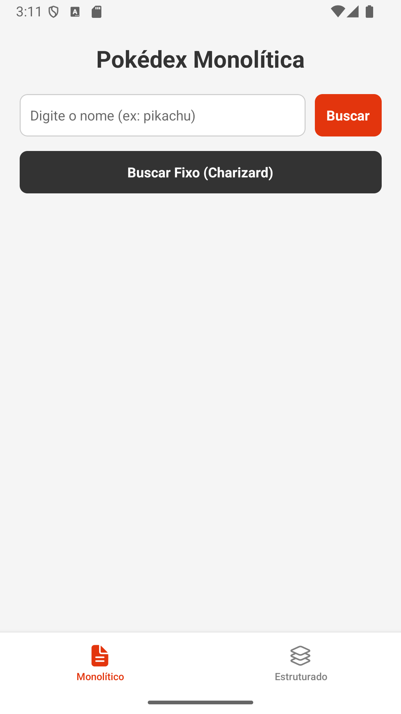
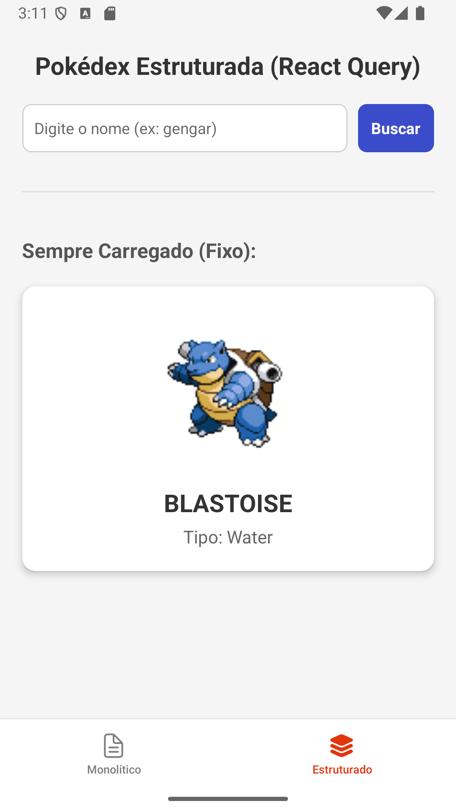

# Consumo de API em React Native: Do Monolito à Arquitetura Estruturada

| Tela 1: Monolítica | Tela 2: Estruturada (React Query) |
| :---: | :---: |
|  |  |

Este projeto tem fins educacionais e demonstra as melhores práticas para o consumo e manipulação de APIs RESTful em um ambiente React Native (utilizando Expo e TypeScript). O projeto consome a [PokéAPI](https://pokeapi.co/) pública para buscar dados de Pokémon.

O foco principal é contrastar duas abordagens de desenvolvimento: a criação de telas acopladas (monolíticas) versus uma arquitetura modularizada utilizando ferramentas modernas de gerenciamento de estado assíncrono.

## Tecnologias e Bibliotecas Utilizadas

- **[React Native](https://reactnative.dev/)** + **[Expo](https://expo.dev/)**: Framework principal.
- **[TypeScript](https://www.typescriptlang.org/)**: Tipagem estática para maior segurança e previsibilidade.
- **[Axios](https://axios-http.com/)**: Cliente HTTP baseado em *Promises* para fazer as requisições à API.
- **[React Query (TanStack Query)](https://tanstack.com/query/latest)**: Gerenciamento de estado assíncrono, cache e sincronização de dados.
- **[React Navigation](https://reactnavigation.org/)**: Navegação do aplicativo (Bottom Tabs Navigation).
- **[React Native Safe Area Context](https://github.com/th3rdwave/react-native-safe-area-context)**: Gerenciamento de áreas seguras (notch, status bar, home indicator).

## Como a aplicação funciona?

O aplicativo é dividido em duas abas principais na navegação inferior, cada uma representando um estágio evolutivo na escrita do código:

### 1. Tela Monolítica (`SimpleScreen.tsx`)
Demonstra o cenário mais básico de consumo de API.
- **Características**: Toda a lógica de requisição (Axios), gerenciamento de estados visuais (`loading`, `error`, `data`) através do `useState`, e a interface gráfica (UI) estão concentrados em um único arquivo.
- **Objetivo**: Mostrar como o código pode crescer rapidamente e se tornar difícil de manter quando as responsabilidades não são divididas.

### 2. Tela Estruturada (`AdvancedScreen.tsx`)
Demonstra um padrão de projeto limpo, escalável e de fácil manutenção.
- **Características**: Utiliza o poder do **React Query**. Não há `useState` ou `useEffect` espalhados pela tela. As requisições são isoladas na pasta `services`, a lógica de cache e estado reside em *Custom Hooks* (`hooks/usePokemon.ts`), e os tipos são rigorosamente definidos em `types/`.
- **Objetivo**: Ensinar separação de responsabilidades (Clean Code), reaproveitamento de componentes e as vantagens de se utilizar uma biblioteca de gerenciamento de dados assíncronos (como o cache automático de requisições já feitas).

## Estrutura de Pastas

A arquitetura do projeto foi pensada para ser escalável:
```text
src
 ┣ components      # Componentes visuais reutilizáveis (ex: PokemonCard)
 ┣ hooks           # Custom hooks, encapsulando a lógica do React Query
 ┣ navigation      # Configuração das rotas e abas (AppNavigator)
 ┣ screens         # As telas principais do app (SimpleScreen e AdvancedScreen)
 ┣ services        # Configurações do Axios e funções de requisição à API
 ┗ types           # Interfaces e tipagens do TypeScript
```

## Como rodar o projeto localmente

### Pré-requisitos
Certifique-se de ter o [Node.js](https://nodejs.org/) instalado em sua máquina. Opcionalmente, instale o aplicativo **Expo Go** em seu smartphone (Android ou iOS) para testar no dispositivo físico.

### Passos de Instalação

1. **Clone o repositório:**
   ```bash
   git clone https://github.com/ViniciussdeOliveira/Aula_ReactNative_Api.git
   ```

2. **Acesse a pasta do projeto:**
   ```bash
   cd Aula_ReactNative_Api
   ```

3. **Instale as dependências:**
   ```bash
   npm install
   # ou
   yarn install
   ```

4. **Inicie o servidor de desenvolvimento do Expo:**
   ```bash
   npx expo start
   ```

5. **Testando o App:**
   - **No celular:** Abra o aplicativo da câmera (iOS) ou o aplicativo Expo Go (Android) e escaneie o QR Code que aparecerá no terminal.
   - **No Emulador:** Pressione `a` no terminal para abrir no Android Emulator ou `i` para o iOS Simulator (necessita do Android Studio ou Xcode configurados).

## Autoria

Material desenvolvido para ensino de arquitetura front-end e consumo de APIs no ecossistema React Native.